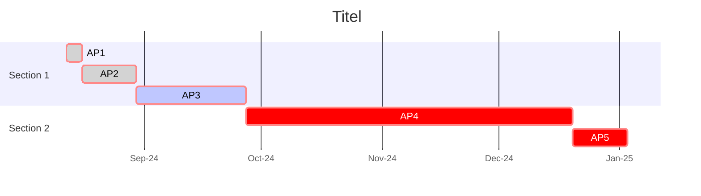

---
{"dg-publish":true,"permalink":"/published/supervision-110925/","noteIcon":""}
---

research design - 

````

````

learning experiments - 
	'supervisor-bot' [[published/project-supervisor-bot\|project-supervisor-bot]]
	'live coding a phd' focus on process

[[published/teaching\|teaching]] experiments - 
	'diy-bot' framework [[published/diy-bot-creation\|diy-bot-creation]] 
	AI literacy workshops 

other ideas, not yet very defined: 
-> <mark style="background: #FFB8EBA6;">speculative prompts</mark> (visual and more?)
-> to imagine other scenarios 
**participatory speculation workshop

technical build of bot
[[published/supervisor-bot-v1-prototype\|supervisor-bot-v1-prototype]]

staff interview planning and timeline
[[published/project-cci-ual-staff-interviews\|project-cci-ual-staff-interviews]]

[[published/MSc-CC-AI-Literacy-Workshop\|MSc-CC-AI-Literacy-Workshop]]